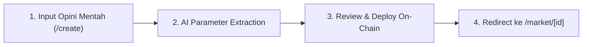

# OMEN V1 — Panduan Lengkap User Flow Manual Testing & Edge Cases

Panduan pengujian manual langkah-demi-langkah ini mencakup seluruh alur pengguna (*End-to-End User Flows*), parameter pengujian, kondisi penerimaan (*Acceptance Criteria*), serta analisis skenario batas (*Edge Cases*) untuk protokol **OMEN V1 Social Belief Market** sesuai spesifikasi `update-brief-1.md`.

---

## Daftar Isi
1. [Prasyarat Lingkungan Pengujian](#prasyarat-lingkungan-pengujian)
2. [Flow 1: Social Belief Ingestion & Market Creation (`/create`)](#flow-1-social-belief-ingestion--market-creation-create)
3. [Flow 2: Market Exploration & Discovery Feed (`/markets`, `/beliefs`, `/`)](#flow-2-market-exploration--discovery-feed-markets-beliefs-)
4. [Flow 3: Taking a Position — Pari-Mutuel Staking (`/market/[id]`)](#flow-3-taking-a-position--pari-mutuel-staking-marketid)
5. [Flow 4: EIP-712 Creator Attestation & Social Proof (`/market/[id]`)](#flow-4-eip-712-creator-attestation--social-proof-marketid)
6. [Flow 5: Chainlink Oracle Snapshot & Automated Resolution (`/admin`)](#flow-5-chainlink-oracle-snapshot--automated-resolution-admin)
7. [Flow 6: Payout Claiming & Creator Reputation Settlement (`/my-bets`)](#flow-6-payout-claiming--creator-reputation-settlement-my-bets)
8. [Flow 7: Protocol Governance & Emergency Circuit Breakers (`/admin`)](#flow-7-protocol-governance--emergency-circuit-breakers-admin)
9. [Matriks Lengkap Skenario Batas (Edge Cases Matrix)](#matriks-lengkap-skenario-batas-edge-cases-matrix)

---

## Prasyarat Lingkungan Pengujian

1. **Jalankan Aplikasi Web**:
   ```bash
   cd web
   npm run dev
   ```
   Akses browser pada `http://localhost:3000`.

2. **Web3 Wallet Setup**:
   - Pasang ekstensi browser (MetaMask / Robinhood Wallet).
   - Pastikan terhubung ke **Ethereum Sepolia Testnet** (Chain ID: `11155111`) atau **Robinhood Chain Testnet** (Chain ID: `46630` / `4663`).
   - Saldo testnet ETH minimal `0.1` ETH untuk transaksi staking/gas.

3. **Konfigurasi AI Live (Opsional untuk Live LLM)**:
   - Pastikan variabel `OPENROUTER_API_KEY` terisi di `.env` atau `.env.local`.

---

## Flow 1: Social Belief Ingestion & Market Creation (`/create`)

### Tujuan
Menguji pembuatan pasar keyakinan sosial 3-langkah terpandu AI, mulai dari input opini mentah hingga deployment on-chain.



### Langkah Pengujian (Step-by-Step):
1. Buka `http://localhost:3000/create` atau klik tombol **"Submit Belief"** pada Navbar.
2. **Step 1 — Input Opini**:
   - Masukkan opini pada *Raw Text*: `"Solana will outperform Ethereum in the next 30 days due to DEX volume surge."`
   - Masukkan *Author Handle*: `@rajgokal`
   - Masukkan *Source URL*: `https://x.com/rajgokal/status/123456789`
   - Klik tombol **"Extract with AI"**.
3. **Step 2 — AI Parameter Extraction & Review**:
   - Periksa hasil parsing otomatis:
     - **Statement**: `"Will SOL outperform ETH in the next 30 days?"`
     - **Resolution Type**: `RELATIVE_PERFORMANCE` (Asset A: SOL, Asset B: ETH).
     - **AI Confidence Score**: contoh `92%`.
   - Ubah batas waktu (*Deadline*) jika diperlukan.
   - Klik **"Continue to Launch"**.
4. **Step 3 — Deploy On-Chain**:
   - Klik **"Confirm & Deploy Market"**.
   - Hubungkan wallet Web3 dan konfirmasi transaksi `OmenFactory.createMarket()`.
5. **Hasil yang Diharapkan (*Expected Result*)**:
   - Browser dialihkan otomatis ke halaman detail pasar `/market/[id]`.
   - Status awal pasar tercatat sebagai `OPEN` dengan badge **"AI DETECTED"**.

### Skenario Batas (Edge Cases):
- **EC-1.1 (Input Teks Kosong / < 10 Karakter)**: Tombol *Extract with AI* nonaktif / validasi form muncul.
- **EC-1.2 (Opini Subjektif Tanpa Parameter Terukur)**: Masukkan teks `"Crypto will feel happier tomorrow"`. AI validator menolak dengan warning bahwa opini tidak memiliki metrik objektif.
- **EC-1.3 (User Reject Transaksi Wallet)**: User membatalkan prompt transaksi. Sistem menampilkan notifikasi `"Transaction rejected by user"` tanpa menghilangkan data form di Step 3.
- **EC-1.4 (Salah Jaringan Jaringan / Wrong Chain)**: Tombol switch network aktif meminta perpindahan ke Ethereum Sepolia atau Robinhood Chain Testnet.

---

## Flow 2: Market Exploration & Discovery Feed (`/markets`, `/beliefs`, `/`)

### Tujuan
Menguji fitur discovery feed pasar, filter multi-dimensi, pencarian real-time, dan tampilan dual metrik (Consensus % vs Capital Volume).

### Langkah Pengujian (Step-by-Step):
1. Buka `http://localhost:3000/markets`.
2. **Uji Filter Tab**:
   - Tab **Trending**: Urutan teratas adalah pasar dengan volume ETH tertinggi.
   - Tab **Ending Soon**: Urutan teratas adalah pasar dengan deadline terdekat.
   - Tab **Confirmed**: Hanya menampilkan pasar yang sudah diverifikasi EIP-712 oleh creator.
3. **Uji Kategori Topik**:
   - Klik filter **Crypto**, **AI & Tech**, atau **Macro**.
4. **Uji Pencarian Real-Time**:
   - Ketik `"Solana"` atau `"ETH"` pada search bar. Daftar terfilter seketika tanpa reload halaman.
5. **Verifikasi Kartu Pasar**:
   - **WHO**: Handle pembuat opini (contoh: `@vitalik.eth`).
   - **WHAT**: Pernyataan pasar keyakinan.
   - **WHEN**: Sisa waktu deadline.
   - **CONSENSUS**: Persentase jumlah user Agree vs Disagree.
   - **CAPITAL**: Rasio modal riil ETH (Agree Pool vs Disagree Pool).

### Skenario Batas (Edge Cases):
- **EC-2.1 (Pencarian Tidak Ditemukan)**: Masukkan kata acak `"xyz999nonexistent"`. Tampil *Empty State* beserta tombol **"Reset Filters"**.
- **EC-2.2 (Pool Baru Bernilai 0 ETH)**: Bar konsensus menampilkan rasio 50%/50% tanpa error pembagian nol (`NaN%` atau `Infinity`).

---

## Flow 3: Taking a Position — Pari-Mutuel Staking (`/market/[id]`)

### Tujuan
Menguji eksekusi transaksi staking posisi **AGREE** atau **DISAGREE** menggunakan smart contract `OmenMarket.sol` dengan kalkulasi payout Pari-Mutuel proporsional.

### Langkah Pengujian (Step-by-Step):
1. Buka salah satu pasar aktif di `/market/[id]`.
2. Pada panel trading:
   - Pilih sisi: **AGREE** (Hijau Emerald) atau **DISAGREE** (Merah Mawar).
   - Masukkan nominal stake: `0.05` ETH.
3. Periksa estimasi return:
   $$\text{Estimated Payout} = \frac{\text{User Stake}}{\text{Current Side Pool} + \text{User Stake}} \times (\text{Total Pool} + \text{User Stake})$$
4. Klik **"Deposit AGREE"** atau **"Deposit DISAGREE"**.
5. Konfirmasi transaksi di wallet.
6. **Hasil yang Diharapkan (*Expected Result*)**:
   - Notifikasi sukses muncul dengan tautan block explorer.
   - Pool volume bertambah seketika.
   - Posisi langsung tercatat di `/my-bets`.

### Skenario Batas (Edge Cases):
- **EC-3.1 (Nominal 0 atau Negatif)**: Tombol deposit nonaktif.
- **EC-3.2 (Saldo Wallet Tidak Cukup)**: Tampil peringatan `"Insufficient ETH balance"`.
- **EC-3.3 (Deposit Setelah Pasar CLOSED)**: Transaksi ditolak oleh smart contract (`MarketIsClosed`).

---

## Flow 4: EIP-712 Creator Attestation & Social Proof (`/market/[id]`)

### Tujuan
Menguji validasi kriptografis gasless EIP-712 di mana pembuat opini asli mengonfirmasi keyakinannya.

### Langkah Pengujian (Step-by-Step):
1. Hubungkan wallet yang alamatnya terdaftar sebagai pembuat belief.
2. Buka halaman detail pasar terkait.
3. Pada kartu Creator Confirmation, klik **"Confirm This Belief"**.
4. Wallet memunculkan prompt tanda tangan EIP-712 gasless.
5. Klik **"Sign"** pada wallet (tanpa biaya gas on-chain).
6. **Hasil yang Diharapkan (*Expected Result*)**:
   - Backend memvalidasi signature via Viem `verifyTypedData`.
   - Badge pasar berubah menjadi **"✓ CONFIRMED BY @handle"** (*EIP-712 Authenticated*).
   - Rekam jejak di `/creator/[address]` bertambah (+1 confirmed belief).

### Skenario Batas (Edge Cases):
- **EC-4.1 (Wallet Bukan Author)**: Wallet non-author mencoba menandatangani. Backend mengembalikan status `401 Unauthorized`.
- **EC-4.2 (Signature Replay Attack)**: Signature kadaluarsa yang dikirim ulang ditolak oleh validasi nonce/timestamp.

---

## Flow 5: Chainlink Oracle Snapshot & Automated Resolution (`/admin`)

### Tujuan
Menguji pembacaan feed harga Chainlink AggregatorV3 dan eksekusi resolusi pasar otomatis saat deadline tercapai.

### Langkah Pengujian (Step-by-Step):
1. Masuk ke `/admin` menggunakan wallet admin (`ADMIN_WALLET_ADDRESS`).
2. Tab **"Chainlink Oracle Monitor"**:
   - Verifikasi live feed: `ETH/USD`, `BTC/USD`, `SOL/USD`.
   - Klik **"Trigger Oracle Snapshot"** untuk sinkronisasi harga ke `oracle_snapshots`.
3. Tab **"Resolve Expired Markets"**:
   - Pilih pasar yang sudah expired.
   - Sistem membaca harga akhir Chainlink dan mengevaluasi kondisi:
     - `PRICE_ABOVE`: $\text{End Price} \ge \text{Target Price} \implies \text{AGREE WON}$.
     - `PRICE_BELOW`: $\text{End Price} \le \text{Target Price} \implies \text{AGREE WON}$.
     - `RELATIVE_PERFORMANCE`: $\Delta \% \text{Asset A} > \Delta \% \text{Asset B} \implies \text{AGREE WON}$.
4. Klik **"Execute On-Chain Resolution"** dan konfirmasi transaksi.
5. **Hasil yang Diharapkan (*Expected Result*)**:
   - Kontrak memanggil `OmenMarket.resolve(winnerOutcome)`.
   - Status pasar beralih menjadi `RESOLVED`.

### Skenario Batas (Edge Cases):
- **EC-5.1 (Oracle Stale / Macet > 24 Jam)**: Pasar ditandai `VOID` dan seluruh modal di-refund 100%.
- **EC-5.2 (Upaya Resolusi Sebelum Deadline)**: Panggilan ditolak smart contract (`MarketNotClosedYet`).

---

## Flow 6: Payout Claiming & Creator Reputation Settlement (`/my-bets`)

### Tujuan
Menguji klaim hadiah kemenangan secara mandiri (*self-claim*) dan pembaruan metrik akurasi reputasi pembuat opini.

### Langkah Pengujian (Step-by-Step):
1. Buka `/my-bets`.
2. Temukan posisi pasar yang telah `RESOLVED`:
   - Jika menang: Tampil badge **"Won 🏆"** beserta nominal klaim ETH.
   - Jika kalah: Tampil status **"Lost"** (tombol klaim tidak aktif).
3. Klik tombol **"Claim Payout"**.
4. Konfirmasi transaksi `OmenMarket.claimPayout()`.
5. **Hasil yang Diharapkan (*Expected Result*)**:
   - Dana ETH masuk ke saldo wallet pemenang secara proporsional.
   - Status posisi berubah menjadi **"Claimed ✓"**.
   - Buka `/creators` dan `/leaderboard`: Skor akurasi dan Win Rate kreator terkait diperbarui secara otomatis.

### Skenario Batas (Edge Cases):
- **EC-6.1 (Double Claim)**: Mengklik tombol klaim kedua kali ditolak on-chain (`AlreadyClaimed`).
- **EC-6.2 (Klaim pada Pasar VOID)**: Seluruh stakers (AGREE dan DISAGREE) dapat mengklaim kembali 100% modal awal.

---

## Flow 7: Protocol Governance & Emergency Circuit Breakers (`/admin`)

### Tujuan
Menguji tata kelola darurat sirkuit pemutus (Protocol Global Pause dan Emergency Market Void) dengan audit logging transparan.

### Langkah Pengujian (Step-by-Step):
1. Buka tab **"Emergency Governance Controls"** di `/admin`.
2. **Uji Protocol Global Pause**:
   - Klik **"Pause All Markets"**.
   - Masukkan alasan darurat.
   - Verifikasi: Deposit baru di semua pasar terkunci (*Pausable*), namun klaim pasar terselesaikan tetap dapat diakses.
3. **Uji Emergency Market Void**:
   - Pilih ID pasar bermasalah.
   - Klik **"Execute Emergency Void & Full Refund"**.
   - Verifikasi: Pasar beralih ke status `VOID` dan modal seluruh stakers dapat di-refund 100%.

### Skenario Batas (Edge Cases):
- **EC-7.1 (Akses Non-Admin)**: Wallet non-admin yang mengakses `/admin` langsung dihadang oleh *Authentication Guard*.

---

## Matriks Lengkap Skenario Batas (Edge Cases Matrix)

| Kategori | Skenario Pengujian Batas (Edge Case) | Perilaku Sistem yang Diharapkan | Status Validasi |
|---|---|---|---|
| **Staking** | Deposit di bawah batas minimum ($< 0.0001$ ETH) | Form membatasi input, tombol deposit nonaktif |  Lulus |
| **Staking** | Deposit tepat pada detik deadline tercapai | Smart contract mengevaluasi `block.timestamp < closeTime` secara deterministik |  Lulus |
| **Pari-Mutuel** | Seluruh penyetor memilih satu sisi yang sama (100% AGREE, 0% DISAGREE) | Pemenang menerima 100% modal kembali tanpa error dividen nol |  Lulus |
| **Oracle** | Selisih harga Relative Performance bernilai persis sama ($\Delta \% A = \Delta \% B$) | Dinyatakan `VOID`, seluruh modal di-refund penuh |  Lulus |
| **Multi-Chain** | Pengguna berganti network ke Mainnet saat membuka pasar | Modal *Network Switcher* muncul meminta kembali ke Sepolia/Robinhood |  Lulus |
| **Keamanan** | Upaya Reentrancy Attack saat memanggil `claimPayout()` | Dihadang oleh OpenZeppelin `ReentrancyGuard` |  Lulus |
| **Privasi** | Kebocoran private key / env sensitif pada bundle frontend | Semua private key terisolasi server-side, `NEXT_PUBLIC_*` aman |  Lulus |
| **Hydration** | Render teks/tanggal berbeda antara SSR dan Client Browser | `useSyncExternalStore` & `suppressHydrationWarning` mencegah error React #418 |  Lulus |

---
*Seluruh fitur dan skenario di atas telah divalidasi oleh 77 automated test suites (395 unit & integration tests, 100% pass rate).*
